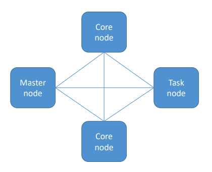

# Amazon EMR

* Elastic MapReduce. Framework Hadoop gerenciado em instâncias EC2.
* Inclui Spark, HBase, Presto, Flink, Hive e mais.
* EMR Notebooks
* Muitos pontos de integração com AWS

---

## EMR Cluster

* **Master Node:** gerencia o cluster
    * status das tasks, monitora a saúde do cluster
    * instância EC2 única
* **Core Node:** armazena os dados no HDFS e executa tasks
    * Pode ser escalado (up/down)
    * Multi-node clusters tem pelo menos um core node
* **Task Node:** executa tasks, mas não armazena dados
    * Opcional
    * Sem risco de perda de dados ao remover
    * Bom uso para `spot instances`

---

## Utilização

**Transient Clsuter**

É terminado uma vez que todos os steps são concluídos.
Carrega os dados, processa, armazena e então tem shut down. Ajuda a economizar.

**Long-Running Cluster**

Basicamente, um data warehouse com processamento periódico em larga escala.

Pode utilizar task nodes usando spot instances para capacidade temporária.

Pode usar instancias reservadas para economizar.

Possuir termination protection por default, auto-termination off.

---

## Storage

**HDFS**

* Hadoop Distributed File System
* Múltiplas cópias armazenadas através das instâncias do cluster para redundância
* Arquivos armazenados como blocos (default size = 128 MB)
* Efêmero - dados no HDFS são perdidos quando o cluster é terminado
* Mas é bem útil para cache intermediário de resultados ou workloads com muito I/O

**EMRFS**

* Utiliza o S3 como se fosse o HDFS
* Habilita persistência de dados após o cluster termination
* EMRFS Consistent View - opcional para consistência no S3
    * Utiliza DynamoDB para rastrear consistência
    * A partir de 2021, S3 possui strongly consistent

---

## EMR Serverless

Escolha uma release do EMR e runtime (Spark, Hive, Presto).

Submita queries / scripts via job run requests.