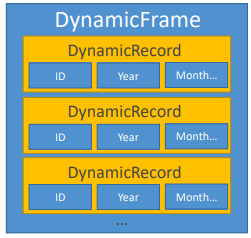
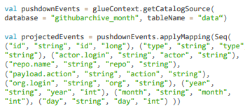

# AWS Glue

Ferramenta Serverless de ETL, discovery e definição de tabelas e schemas, catálogo central de dados, orquestração de jobs e mais.

---

## 1. Glue Crawler / Data Catalog

Scaneia dados no S3 e faz a criação de schemas. Podem ser executados periodicamente.

Popula as informações do Glue Data Catalog, armazenando `apenas as definições` das tabelas (metadados). Os dados permanecem no S3.

Uma vez catalogado, é possível consultar o dado (estruturado ou não) como se fosse um dado estruturado (like structured) utilizando:

* Redshift Spectrum
* Athena
* EMR
* QuickSight

**Partições**

Glue Crawler irá extrair partições baseado em como o dado está organizado no S3. Por exemplo, para um dado de IoT com prefixo `device/ano/mes/dia/` serão geradas as partições `device` > `ano` > `mes` > `dia` (nesta ordem).

---

## 2. Glue + Hive

O `Hive` te permite executar SQL-like queries no EMR.

O Glue Data Catalog pode servir como um `metastore` no Hive.

Também é possível importar o `Hive Metastore` para o Glue.

---

## 3. Glue ETL

* Geração automática de código
* Scala ou Python
* Criptografia
    * Server-side (at rest)
    * SSL (in transit)
* Suporta `event-driven` (orientação a eventos)
* Possível provisionar mais `DPUs` (data processing units) para aumentar a performance de Spark Jobs
    * Habilitando `job metrics`, pode te ajudar a entender a capacidade máxima em DPUs que você precisa
* Erros reportados no CloudWatch
* Transformação, Limpeza e Enriquecimentos de dados (antes de fazer análises)
    * Gera o código do ETL em Python ou Scala. Você pode modificar o código
    * Te permite fornecer seu próprio Spark ou PySpark script
    * Destino pode ser S3, JDBC (RDS, Redshift), ou o Glue Data Catalog
* Totalmente gerenciado, pague apenas pelos recursos consumidos
* Jobs executam em uma plataforma Spark Serverless
* `Glue Scheduler` para agendar a execução dos jobs
* `Glue Triggers` para automatizar a execução dos jobs baseado em eventos

---

### 3.1. DynamicFrame

É uma coleção de `DynamicRecords`.

* DynamicRecords são auto-descritivos, possuem schema
* Muito parecido com um Spark DataFrame
* Scala e Python APIs

---

### 3.2. Tranformações

**Transformações agrupadas**

* DropFileds, DropNullFields
* Filter
* Join
* Map (adição de campos, remoção de campos, lookup externo)

**Transformações de Machine Learning**

* FindMatches ML: identifica duplicatas ou remove registros no seu dataset, até que seus registros não tenham um identificar único comum ou campos com match exato.

**Conversões de Formato**

CSV, JSON, Avro, Parquet, ORC, XML.

**Apache Spark Transformations (ex.: K-Means)**

Pode converter entre Spark DataFrame e Glue DynamicFrame.

---

### 3.3. ResolveChoice

Lida com ambiguidades em um DynamicFrame e retorna um novo.

Por exemplo, dois campos com o mesmo nome `price`.

* `make_cols`: cria uma nova coluna para cada tipo (ex.: `price_double` e `price_string`)
* `cast`: converte todos os valores para um tipo específico
* `make_struct`: cria uma estrutura que contém cada tipo de dados

---

### 3.4. Modificando o catálogo de dados

Scripts ETL podem modificar o schema e as partições necessárias.

* Adicionando novas partições
    * Re-execute o crawler, ou
    * Use no script `enableUpdateCatalog and partitionKeys`
* Atualizando o schema da tabela
    * Re-execute o crawler, ou
    * Utilize `enableUpdateCatalog`/ `updateBehavior` no script
* Criando novas tabelas
    * `enableUpdateCatalog`/ `updateBehavior` com `setCatalogInfo`
* Restrições:
    * S3 only
    * JSON, CSV, Avro, Parquet only
    * Parquet requer código especial
    * Nested Schemas não são suportados

---

### 3.5. Glue Development Endpoints

Desenvolva scripts ETL usando um notebook (e então crie um ETL job que executa seu script usando spark e glue)

Endpoint está dentro de uma VPC controlado por security groups via:

* Apache Zeppelin na sua maquina local
* Zeppelin notebook server na EC2 (via glue console)
* SageMaker notebook
* Terminal window
* PyCharm professional edition

Utilize Elastic IP para acessar o endereço privado do endpoint.

---

### 3.6. Running Glue Jobs

**Job bookmarks**

Persiste o estado de execução do job. Previne contra processamento de dados antigos. O Glue armazena a informação sobre quais dados já foram processados em execução anteriores, para que não sejam reprocessados.

Funciona com S3 e bancos de dados relacionais via JDBC (processando apenas Primary Keys novas, não processa se uma PK antiga sofrer update).

---

### 3.7. Anti-patterns

Glue ETL é baseado em spark, se você quer usar outras engines (Hive, Pig, etc), uma pipeline de dados com EMR é melhor.