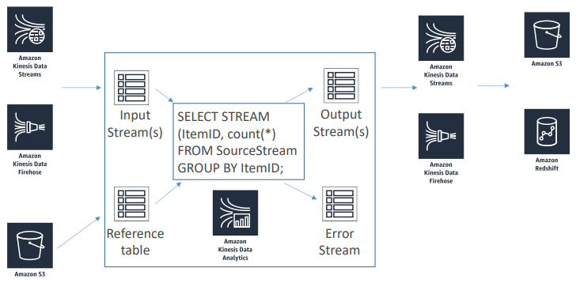
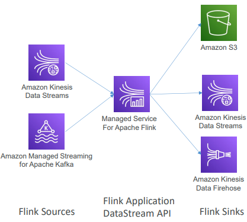

# Kinesis Data Analytics / Managed Service for Apache Flink

Consultas (query) em stream de dados em near real time.

---

## Managed Service for Apache Flink

Formalmente, Kinesis Data Analytics para Apache Flink ou Java. Serverless.

* Kinesis Data Analytics utiliza o Flink como engine
* Suporta python ou scala
* Flink é um framework para processamento de dados de stream

MSAF integra Flink com AWS. Em vez de usar SQL, você pode desenvolver seu próprio aplicatibo Flink do zero e carregá-lo no MSAF via S3.

**Casos de uso**

* Streaming ETL
* Geração contínua de métricas
* Analytics Responsivo

---

## RANDON_CUT_FOREST

* Função SQL usada para detecção de anomalias em colunas numéricas em um stream
* É uma nova forma de identificar outliers em um dataset