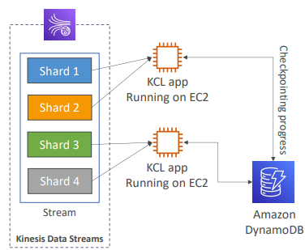
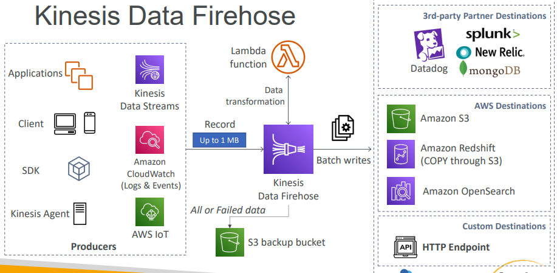
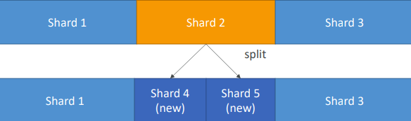
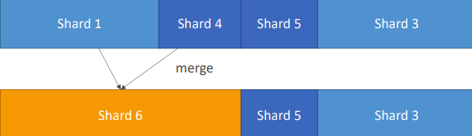
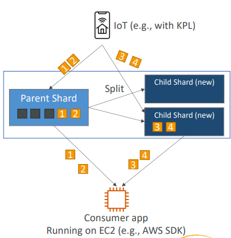
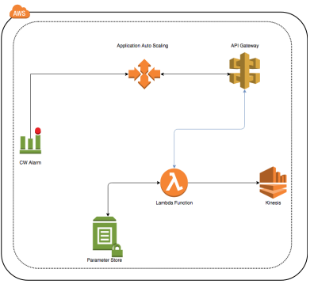
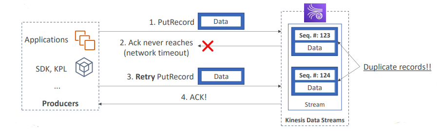

# Kinesis Data Streams

É utilizado para coletar e processar grandes fluxos de registros de dados em tempo real.

Os `produtores` enviam dados por *push* continuamente ao Kinesis Data Streams, os `consumidores` processam em tempo real.

Os consumidores (como um aplicativo personalizado executado na Amazon EC2 ou um stream de entrega do Amazon Data Firehose) podem armazenar seus resultados usando um serviço AWS como o Amazon DynamoDB, Redshift ou S3.

---

## Terminologia

**Fluxo de Dados**

Um `Fluxo de Dados` (Stream) é um conjunto de `shards`. Cada shard tem uma sequência de `Data Records` (registros de dados). Cada data record tem um `sequence number` atribuído pelo Kinesis Data Streams.

**Registros de Dados**

Um data record é a unidade de dados armazenado em um Kinesis Stream. Os data records são compostos de um `sequence number`, uma `partition key` e um `blob de dados`, que é uma sequência de bytes imutável. O Kinesis Streams não inspeciona, interpreta nem altera dados no blob. Um blob de dados pode ter até 1 MB.

A partition key ajuda a definir para qual Shard o Data Record irá.

Os produtos podem enviar dados ao Kinesis Stream a uma taxa de 1 MB/s ou 1.000 msg/s por shard.

Com relação ao consumo, temos 2 formatos:

* Shared: 2 MB/s por shard para todos os consumidores;
* Enhanced: 2 MB/s por shard por consumer.

---

## Propriedades

* Período de retenção de 1 a 365 dias;
* Possível reprocessar os dados (replay);
* Uma vez que o dado é inserido no Kinesis, ele não pode ser deletado (imutabilidade);
* Dados que são compartilhados na mesma partição vão para o mesmo shard (ordering);
* Producers: AWS SDK, Kinesis Producer Library (KPL), Kinesis Agent;
* Consumers:
    * Write your own: Kinesis Client Library (KCL), AWS SDK;
    * Managed: AWS Lambda, Kinesis Data Firehose, Kinesis Data Analytics.

---

## Capacity Modes

**Provisioned mode**

Você escolhe o número de shards provisionados e escala eles manualmente ou usando API.

Cada shard possui 1 MB/s ou 1.000 records/s de entrada.

Cada shard possui 2 MB/s de saída (classic ou enhanced fan-out consumer).

Você paga por shard provisionado por hora.

**On-demand mode**

É ideal quando você não conhece seus eventos de capacidade.

Você não precisa provisionar ou gerenciar a capacidade.

Default capacity = 4 MB/s in ou 4.000 records/s.

Escala automaticamente baseado no pico de throughput observado nos últimos 30 dias.

Você paga por stream por hora e data in/out por GB.

---

## Producers

### Kinesis SDK

Permite que você escreva códigos ou use a CLI para enviar dados diretamente para o Amazon Kinesis Streams.

Utiliza a API `PutRecord` (um record) ou `PutRecords` (muitos records).

`PutRecords` utiliza batching e, por isso, aumenta a sua taxa de transferência, pois você envia vários registros como parte de uma solicitação HTTP e, portanto, está economizando em solicitações HTTP e obtendo um throughput maior.

No entanto, se você ultrapassar os limites de transferência, irá tomar um erro de `ProvisionedThroughputExceeded`.

Você pode usá-lo com aplicativos mobile (AWS Mobile SDK: Android, iOS, etc).

Você utiliza Kinesis SDK quando temos um caso de uso de baixo throughput, quando não nos importamos com uma alta latência, quando queremos uma API muito simples ou estejamos trabalhando diretamente com AWS Lambda.

Existem também alguns recursos gerenciados da AWS que utilizam o Kinesis Producer SDK:

* CloudWatch Logs (para enviar os logs diretamente ao Kinesis);
* AWS IoT;
* Kinesis Data Analytics.

**ProvisionedThroughputExceeded Exceptions**

Acontece quando você enviar mais dados do que sua capacidade de throughput provisionada.

É preciso checar se você não tem um `hot shard` (quando sua partition key é ruim e muitos dados caem na mesma partição).

A solução seria aplicar `backoff`, melhorar a escolha da partition key ou escalar o número de shards.

---

### Kinesis Producer Library (KPL)

É um pouco mais avançada. Você escreve um código melhor e possui alguns recursos muito bons que te permitem obter um rendimento aprimorado no Kinesis Streams.

É uma biblioteca C++ ou Java fácil de usar e altamente configurável.

É usado quando você quer criar produtores de alto desempenho e longa duração.

Possui mecanismo de `retry` automático e configurável.

Possui `API Síncrona` (a mesma do SDK) e `API Assíncrona` (que possui melhor desempenho).

Geralmente, quando precisamos enviar dados de forma assíncrona, utilizamos o KPL.

É possível submeter métricas de monitoração para o CloudWatch.

Suporta um mecanismo com 2 componentes chamado `Batching` (ambos ligados por default). Aumenta o throughput e diminui o custo:

* **Collect** recrods e escrita a multiplos shards no mesmo `PutRecords` API call;
* **Aggregate** aumenta a latência mas também aumenta a eficiência. Capacidade de armazenar múltiplos recrods em um (com isso, indo além do limite de 1.000 records/s). Também te permite aumentar o payload size, maximizando o uso do throughput de 1 MB/s de forma consistente.

> **Obs.:** podemos influenciar a eficiencia do batching introduzindo delay modificando o parâmetro `RecordMaxBufferedTime` (default 100 ms).

Compression não é compatível com o Kinesis Producer Library, deve ser implementado pelo próprio usuário.

Quando enviamos records usando KPL, o registro precisa ser decodificado com um Kinesis Client Library (KCL) ou uma biblioteca auxiliar, não sendo possível simplesmente lê-lo usando a CLI.

Usando o KPL, pode ocorrer um atraso de no máximo um `RecordMaxBufferedTime` o que seria um problema em casos em que o seu aplicativo não possui tolerância a delay adicional. Neste caso é melhor usar o AWS SDK diretamente.

Um exemplo seria o caso de sensor IoT. Se o sensor ficar offline por 30 minutos, o KPL irá reter os dados e os acumular. Isso significa que quando o dispositivo ficar online novamente, pode demorar um pouco para que os dados mais recentes cheguem aos meu fluxo de dados do Kinesis, o que não funcionaria bem caso tenhamos interesse em atuar apenas nos dados mais recentes.

---

### Kinesis Agent

É um programa Linux executado em seu servidor que te permite obter um log file e o enviar ao Kinesis Streams.

É um agent baseado em Java, construído com base na biblioteca do KPL.

É possível escrever dados de multiplos diretórios em múltiplos streams. Também permite pré-processar os dados antes de enviá-los ao stream (single line, csv to json, log to json,...).

É recomendado sempre que precisar fazer agregação de logs em massa quase em tempo real.

---

### Bibliotecas de terceiros

Também é possível utilizar bibliotecas de terceiros, que geralmente se baseiam no SDK, como Apache Spark, Kafka Connect, NiFi, Log4j, etc.

---

## Consumers

### Kinesis SDK

**Claissic Kinesis**: records são lidos (pull) de um shard por consumers.

Cada shard tem 2 MB total de throughput agregado.

`GetRecords` retorna até 10 MB de dados (espera de até 5 segundos para fazer um outro GetRecords) ou até 10.000 records.

Também há um limite máximo de 5 GetRecords API calls por shard por segundo = 200 ms de latência.

Dessa forma, se 5 aplicações consumer consumem dados de um mesmo shard, significa que cada consumer pode ler 400 KB/s (2 MB dividido por 5 consumers). Quanto mais consumidores você tiver, menor será a taxa de transferência por consumidor.

---

### Kinesis Client Library (KCL)

Java-first Library, mas existem em outras linguagens (Golang, Python, Ruby, Node, etc).

Te permite ler records do Kinesis produzidos com KPL (de-aggregation).

Oferece a possibilidade de vários consumidores compartilharems vários shards usando o conceito de grupo.

Possui mecanismos de checkpoint de progresso.

Tem suporte a uso do Dynamo DB para coordenar e gravar checkpoint (uma linha por shard). É preciso garantir que a tabela tenha WCU e RCU suficiente ou o DynamoDB irá causar lentidão no KCL.

---

### Kinesis Connector Library (obsoleto)

Biblioteca Java mais antiga (2016). Usada para gravar dados no S3, DynamoDB, Redshift ou OpenSearch.

O Connector Library é executado em uma instância EC2.

Para alguns destes destinos (como S3 e Redshift), podemos usar o Kinesis Firehose, e para outros podemos usar o AWS Lambda

---

### Bibliotecas de terceiros

Apache spark, Kafka Connect, etc.

---

### Kinesis Fireshose

* Serviço gerenciado pela AWS
* Near Real Time (Buffer baseado em tempo e tamanho)
* Carrega dados no Redshift, S3, OpenSearch, Splunk
* Escalonamento automático
* Suporta muitos formatos de dados
* Conversão de dados de JSON para Parquet/ORC (apenas para S3)
* Transformação de dados através de Lambda Function (ex.: CSV => JSON)
* Suporta compressão quando o destino é o S3 (GZIP, ZIP e Snappy)
* Para compressão com Redshift suporta apenas GZIP
* Pague pela quantidade de dados que passa pelo Firehose
* Spark / KCL `NÃO` conseguem ler do Kinesis Data Firehose

**Firehose Buffer Sizing**

* Firehose acumula records em um buffer
* O Buffer é baseado em time ou size rules
* Firehose pode automaticamente aumentar o buffer size para aumentar o throughput

---

### AWS Lambda

O Lambda pode ler records do Kinesis Data Stream. Também possui uma pequena biblioteca para desagregar records do KPL.

Também pode ser usado para fazer um ETL leve e enviar os dados ao S3, DynamoDB, Redshift, OpenSearch, etc.

Lambda também tem um batch size configurável.

---

### Kinesis Consumer Enhanced Fan-Out

Funciona com KCL 2.0 e AWS Lambda.

Cada consumer possui 2 MB/s provisionado de througput por shard, o que significa que 20 consumers terão 40 MB/s por shard agregado.

**Standard Consumer:**

* Baixo número de aplicações consumidores (1, 2, 3,...)
* Pode tolerar latência de aproximadamente 200 ms
* Minimiza o custo

**Enhanced Fan Out Consumer:**

* Múltiplas aplicações consumidores para o mesmo stream
* Baixa latência de aproximadamente 70 ms
* Alto custo
* Default limit de 20 consumers usando enhanced fan-out por shard

---

## Kinesis Operations

### Adding Shards

Também chamado de `shard splitting`. Pode ser usado para aumetar a capacidade do stream (1 MB/s data in por shard).

Pode ser usado para dividir um "hot shard".

---

### Merging Shards

Diminui a capacidade do stream, reduzindo o custo.

Pode ser usado para agrupar dois shards com baixo tráfego.

---

### Registros fora de ordem após resharding

Após o reshard (add ou merge), você pode ler a partir dos child shards.

Entretanto, dados que você ainda não leu ainda podem estar no parent shard.

Se você começar a ler do child shard antes de completar as leituras do parent shard, `você poderá ler dados de um hash key particular fora de ordem`.

Após um reshard, leia totalmente os records do parent shard até não ter mais novos registros nele.

> **Obs.:** O KCL tem essa lógica embutida.

---

### Auto Scaling

Não é uma feature nativa do Kinesis. A API call usada para mudar o número de shards é `UpdateShardCount`.

Podemos implementar auto scaling com AWS Lambda.

**Limites**

* Resharding não pode ser feito em paralelo
* Você pode fazer um resharding por vez e ele pode levar alguns segundos
* Para 1.000 shards, leva cerca de 30.000 s (8.3 h) para dobrar os shards para 2.000

---

### Duplicatas (from Producers)

* Producer retries podem criar duplicatas devido a timeouts de rede
* Embora os dois registros tenham dados identicos, eles possuem key numbers exclusivos
* Fix: faça o `embeed do record ID único` nos dados para de-duplicar do lado do consumer

---

### Duplicatas (from Consumer)

* Consumer retries podem fazer sua aplicação ler o mesmo dado duas vezes
* Consumer retries acontecem quando o processador de registros reestarta:
    * Um worker é terminado inesperadamente
    * Worker instances são adicionadas ou removidas
    * Shards passam por merge ou split
    * A aplicação é deployada

* Fix:
    * Faça sua aplicação consumidora idenpotente
    * Se o destino final puder lidar com duplicatas, é recomendado tratar lá

---

## Troubleshooting: Producers

**Escrita muito lenta**

* Exceção de limites de serviço. Check thoughput exceptions
* Existem limites a nivel de shard para escritas e leituras
* Outras operações (CreateStream, ListStream, DescribeStream) tem limites de 5-20 calls/ s

**Large Producers**

* Batch. Use KPL. PutRecords com multi-records, ou aggregate records em arquivos grandes

**Small Producers**

* Utilize PutRecords ou Kineses Recorder no AWS Mobile SDKs

**Stream retorna erro 500 ou 503**

* Indica um erro `AmazonKinesisException` menor que 1%
* Implemente um mecanismo de retry

**Erro de conexão do Flink para o Kinesis**

* Network issues ou problema nos recursos do ambiente do Flink
* Pode ser um erro de configuração na VPC

**Erros de timeout do Flink para o Kinesis**

* Ajuste o `RequestTimeout` e `#setQueueLimit` no FlinkKinesisProducer

**Throttilng**

* Verifique a existência de hot shards com enhanced monitoring (shard-level)
* Verifique logs para "micro spikes"
* Tente um rando partition key ou melhore a distribuição de keys
* Use exponential backoff
* Rate limit

---

## Troubleshooting: Consumers

**Records skipped com KCL**

* Verifique unhandled exceptions no processRecords

**Records no mesmo shard processados mais de uma vez**

* Ajuste o failover limit

**Leituras muito lentas**

* Aumente o número de shards
* maxRecords por chamada está muito lento
* O seu código é muito lento

**GetRecords retornando resultados nulos**

* Isto é normal, apenas continue chamado GetRecords

**Shared Iterator expires**

* Precisa de mais capacidade de escrita na shard table do DynamoDB

**Falha no Recrod Processing**

* Aumente o retention period
* Usualmente, recursos insuficientes

**ReadProvisionedThroughputExceeded exception**

* Thorttling
* Reshard o seu stream
* Reduza o tamanho de GetRecords requests
* Use enhanced fan-out
* Use retries e exponential backoff

**Alta latência**

* Monitore com `GetRecords.Latency` e `IteratorAge`
* Aumente a quantidade de shards
* Aumente o preíodo de retenção
* Verifique o uso de CPU e memória

**Erros 500**

* O mesmo que para Producer - taxa de erro < 1%
* Implemente um mecanismo de retry

**Blocked os Stuck KCL Application**

* Otimize o seu método de `processRecords`
* Aumente maxLeasesPerWorker
* Habilite KCL debug logs

---